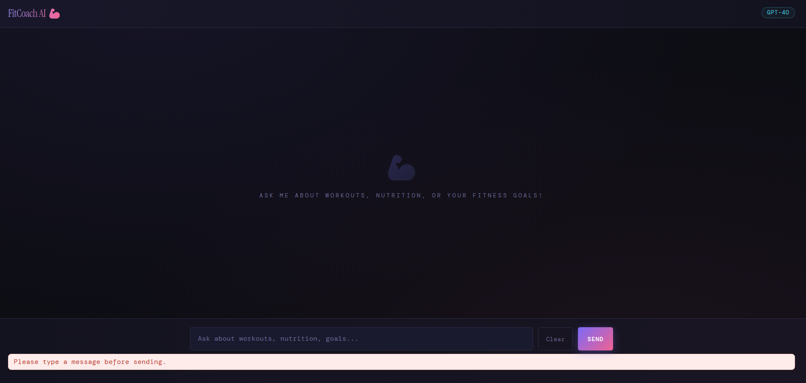
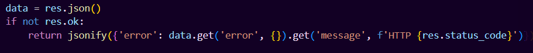
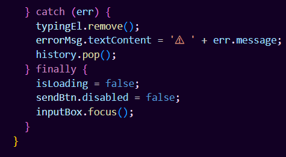

Created By: Kaitlyn Fortuna
Date: 04/07/2026

Project Title: FitCoach AI — Personal Fitness Chatbot

Description of chatbot functionality:
FitCoach AI is a web-based chatbot that acts as a personal fitness coach and nutritionist.
Users can ask questions about workout plans, nutrition advice, weight loss, muscle building,
and general healthy habits. The AI asks about the user's fitness level and goals before
giving tailored recommendations, and advises consulting a doctor for any injury or medical concern.

Technologies used:
HTML, CSS, JavaScript, Python Flask, and OpenRouter API

Prerequisites:
- Python 3.8+ installed
- Node.js 18+ installed
- An OpenRouter API key (free tier works): https://openrouter.ai/keys

Setup and run instructions:
1. Clone or download the project, then open a terminal in the project root.

2. Install backend dependencies:
     pip install flask flask-cors requests

3. Set your OpenRouter API key as an environment variable:
     On Mac/Linux:   export OPENROUTER_AI_API_KEY="your_key_here"
     On Windows:     set OPENROUTER_AI_API_KEY=your_key_here

4. Start the backend server:
     cd backend
     python api.py
   The Flask server will start at http://localhost:5000

5. In a new terminal, install and start the frontend:
     cd frontend
     npm install
     npm run dev
   The frontend will be served at http://localhost:3000

6. Open http://localhost:3000 in your browser.
   Enter your OpenRouter API key in the setup panel, select a model, and start chatting.

Note: Both the backend (port 5000) and frontend (port 3000) must be running at the same time.

7. Enter your API Key on the start menu and select your preferred LLM to use. 

Note: For quick testing there is an API Key provided in the .env file for the graders. Once the start chatting button is pressed then the user can ask their fitness questions to the AI chatbot.

API Used:
OpenRouter API was used. This API is a united interface for LLMs. All of the accessible AIs identified in the project are available to use in the free-tier of the OpenRouter API key. This is a standardized API which means there is need to change code when switching between models or providers. Due to this feature, I included a dropdown menu for the user to choose which LLM they want to communicate with.

Screenshots or example outputs:

Empty Message Error-

Handle API Failures Gracefully-
Backend

Frontend

