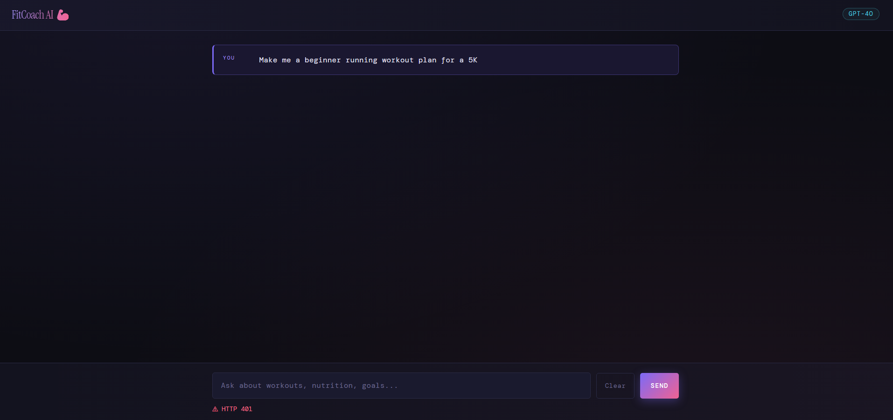
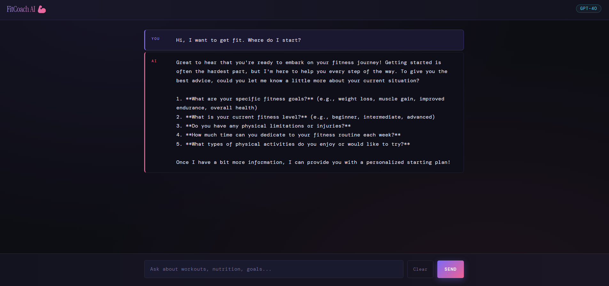
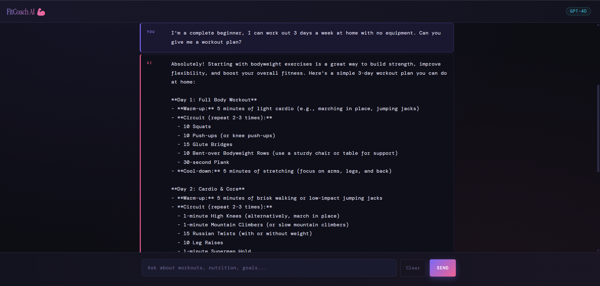
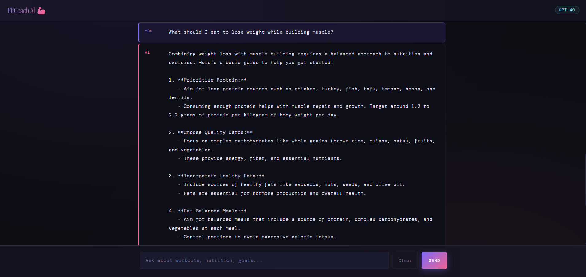
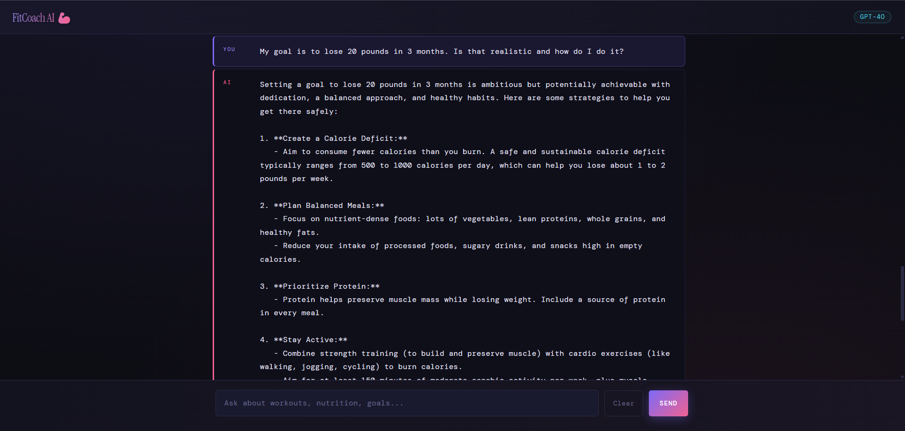
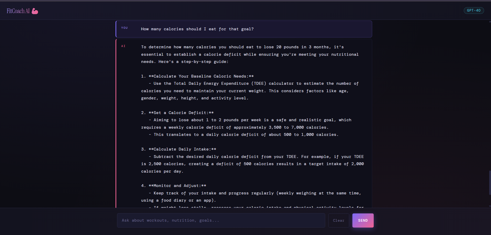
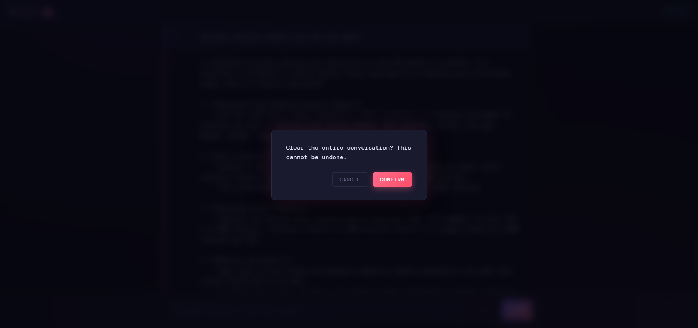

Created By: Kaitlyn Fortuna
Date: 04/07/2026

Project Title: FitCoach AI — Personal Fitness Chatbot

Description of chatbot functionality:
FitCoach AI is a web-based chatbot that acts as a personal fitness coach and nutritionist.
Users can ask questions about workout plans, nutrition advice, weight loss, muscle building,
and general healthy habits. The AI asks about the user's fitness level and goals before
giving tailored recommendations, and advises consulting a doctor for any injury or medical concern.

The chatbot supports multiple AI models via a dropdown menu including GPT-4o Mini, GPT-4o, Claude 3.5 Haiku, Claude 3.7 Sonnet, and Llama 3.3 70B. Chat history is maintained throughout the session, and users can clear the conversation at any time.

Technologies used:
HTML, CSS, JavaScript, Python Flask, and OpenRouter API

Setup and Run Instructions:
Begin by installing the required Python dependencies. Open a terminal and run pip install flask flask-cors requests to install Flask and its dependencies.

Next, add your OpenRouter API key to the backend. Open backend/api.py and replace the placeholder on the API_KEY line with your actual key from openrouter.ai/keys.

Once the key is set, start the backend server by opening a terminal, navigating into the backend folder with cd backend, and running python api.py. You should see "Running on http://127.0.0.1:5000" confirming the server is active. Keep this terminal open the entire time you are using the app — closing it stops the server.

With the backend running, open a second terminal for the frontend. Navigate into the frontend folder with cd frontend, run npm install to install dependencies, then run npm run dev to start the frontend server on http://localhost:3000.
Finally, open your browser and go to http://localhost:3000. Select an AI model from the dropdown menu, type a message into the input box, and click Send to begin chatting with FitCoach AI.

Prerequisites:
- Python 3.8+ installed
- Node.js 18+ installed
- An OpenRouter API key (free tier works): https://openrouter.ai/keys

API Used:
OpenRouter API was used. This API is a united interface for LLMs. All of the accessible AIs identified in the project are available to use in the free-tier of the OpenRouter API key. This is a standardized API which means there is need to change code when switching between models or providers. Due to this feature, I included a dropdown menu for the user to choose which LLM they want to communicate with.

Screenshots or example outputs:

Empty Message Error

Handle API Failures Gracefully

-Prompts-

Introduction

Workout Plan

Nutrition Advice

Goal-based Coaching

Follow-up Question

Clear Conversation
